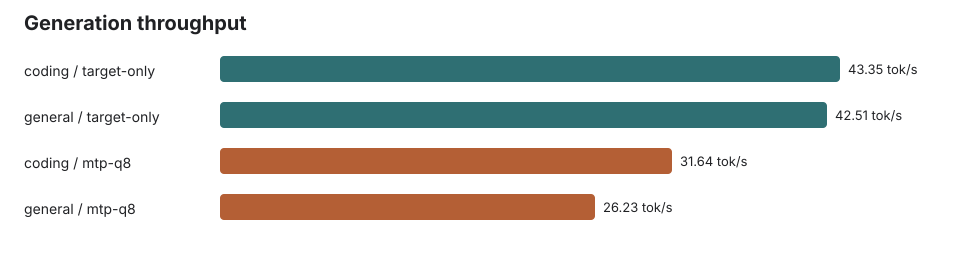
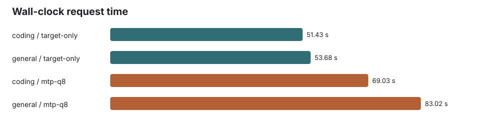
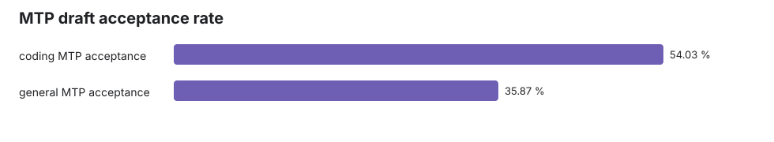

# Gemma 4 12B Q4_K_XL vs Q8 MTP Assistant 2K Benchmark

Generated: 2026-06-03T14:12:28 local time.

## Result

In this local llama.cpp branch run, the Q8_0 MTP assistant was active but slower than target-only on both prompts.

| Prompt | Input tokens | Output tokens | Target-only tok/s | MTP tok/s | MTP speed | Acceptance | Accepted / generated draft tokens |
|---|---:|---:|---:|---:|---:|---:|---:|
| coding | 2053 | 2048 | 43.35 | 31.64 | 73.0% | 54.0% | 1266 / 2343 |
| general | 2059 | 2048 | 42.51 | 26.23 | 61.7% | 35.9% | 1061 / 2958 |

## Configuration

- Target: `gemma-4-12b-it-UD-Q4_K_XL.gguf`
- Assistant: `gemma-4-12B-it-assistant-Q8_0.gguf`
- Context: `65536`
- Batch: `4096`
- Ubatch: `512`
- Flash attention: on
- MTP lane: `--spec-type draft-mtp`, draft max `3`, draft KV `q8_0/q8_0`
- Generation: `n_predict=2048`, `temperature=0`, server `--ignore-eos`

## Notes

EOS was ignored to force exactly 2048 output tokens. This makes the run useful for throughput stress, but not for answer-quality assessment. Outputs diverged between target-only and MTP, so this is not a correctness equivalence result.

## Charts

## Artifacts

- `results.json`: machine-readable metrics
- `response-*.json` and `response-*.txt`: retained raw responses
- `logs/server-target-only.log` and `logs/server-mtp-q8.log`: llama-server load and timing logs
- `prompts/coding.txt` and `prompts/general.txt`: exact prompts
