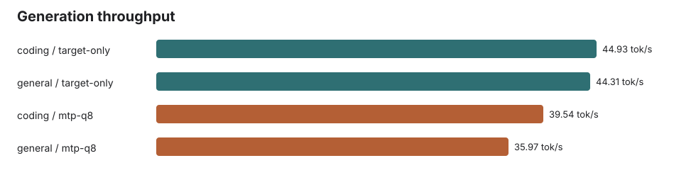
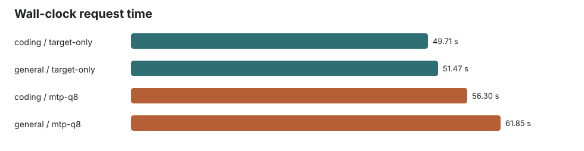
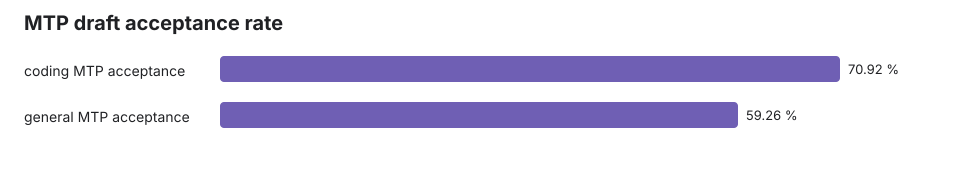

# Gemma 4 12B Q4_K_XL vs Q8 MTP Assistant 2K Benchmark: Draft2, TopK1, Temp0.6

Generated: 2026-06-03T14:21:09 local time.

## Result

Q8_0 MTP was active and accepted draft tokens, but remained slower than target-only on both prompts.

| Prompt | Input tokens | Output tokens | Target-only tok/s | MTP tok/s | MTP speed | Acceptance | Accepted / generated draft tokens |
|---|---:|---:|---:|---:|---:|---:|---:|
| coding | 2053 | 2048 | 44.93 | 39.54 | 88.0% | 70.9% | 1200 / 1692 |
| general | 2059 | 2048 | 44.31 | 35.97 | 81.2% | 59.3% | 1110 / 1873 |

## Configuration

- Target: `gemma-4-12b-it-UD-Q4_K_XL.gguf`
- Assistant: `gemma-4-12B-it-assistant-Q8_0.gguf`
- Context: `65536`
- Batch: `4096`
- Ubatch: `512`
- Flash attention: on
- MTP lane: `--spec-type draft-mtp`, draft max `2`, draft KV `q8_0/q8_0`
- Drafter sampler patch: MTP `top_k` changed from `10` to `1` in `common/speculative.cpp`
- Accepter generation: `n_predict=2048`, `temperature=0.6`, server `--ignore-eos`

## Notes

Because `temperature=0.6` was requested for the accepter, this run is a sampled throughput comparison, not a deterministic equivalence test. EOS was ignored to force exactly 2048 output tokens.

## Charts

## Artifacts

- `results.json`: machine-readable metrics
- `response-*.json` and `response-*.txt`: retained raw responses
- `logs/server-target-only.log` and `logs/server-mtp-q8.log`: llama-server load and timing logs
- `prompts/coding.txt` and `prompts/general.txt`: exact prompts
