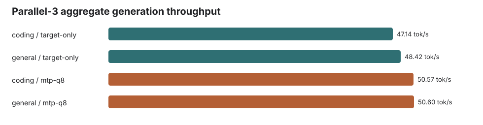
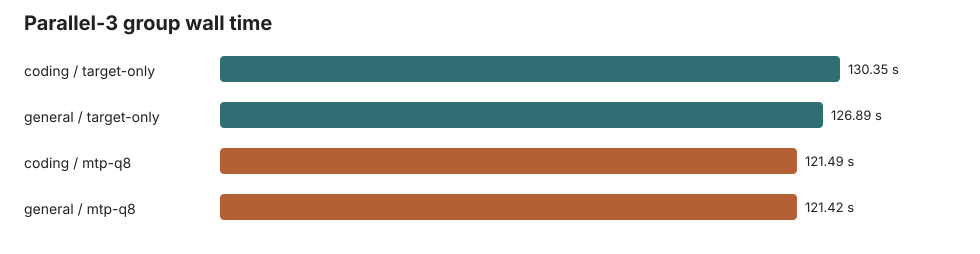
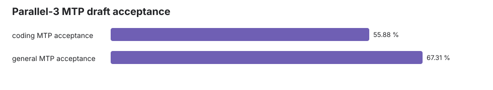

# Gemma 4 12B Q4_K_XL Parallel-3 Benchmark

Generated: 2026-06-03T14:35:54 local time.

Three concurrent 2K-input / 2048-output streams per prompt family. Draft max 2, drafter top-k 1, accepter temperature 0.6.

| Prompt family | Target aggregate tok/s | MTP aggregate tok/s | MTP speed | Target group wall s | MTP group wall s | MTP acceptance | Accepted / generated draft tokens |
|---|---:|---:|---:|---:|---:|---:|---:|
| coding | 47.14 | 50.57 | 107.3% | 130.35 | 121.49 | 55.9% | 3240 / 5798 |
| general | 48.42 | 50.60 | 104.5% | 126.89 | 121.42 | 67.3% | 3523 / 5234 |

## Charts

## Artifacts

- `parallel3-results.json`: machine-readable metrics
- `parallel3_analysis.html`: full HTML report
- `response-*.json` and `response-*.txt`: raw responses
- `logs/server-target-only.log` and `logs/server-mtp-q8.log`: server logs
- `prompts/*.txt`: exact prompts
